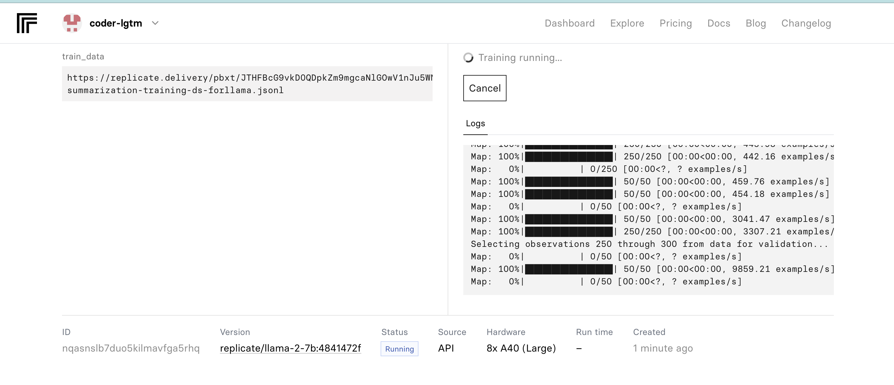

# Demystifying Generative AI And Machine Learning Models
### Women In Tech Boston; Oct 2-3, 2023
<table><tr>
<td> </td>
  <td></td>
</tr></table>


## Hands-On workshop to build custom application using Large Language Models (Llama2)
This repository contains instructions and code for building custom applications using LLM, and Dataset Builder Utility code for generating a custom mini training dataset for cost effective model tuning.

### Goals
* Get familiarized with Generative AI models ecosystem
* Review core LLM concepts
* Overview of Prompt Engineering
* Learn how to fine tune a custom model for a domain specific use case
* Build an app using a pre-trained base LLM and domain specific fine-tuned LLM

  
### Repository contains
* Installation instructions for the Open Source technologies this workshop uses
* Account setup instructions to use Open Sourced Meta Llama2 models
* Code to build simple chatbot application using Llama2 and Streamlit
* Custom mini dataset creator for fine tuning Llama2
* Sample datasets
* Replicate model training scripts
* Dataset builder utility code
  
## Pre-workshop setup steps
### We will be using following tools and resources
* Our choice of programming language -  [Python 3.8](https://www.python.org/downloads/release/python-380/)
* Quick and elegant app builder - [Streamlit](https://streamlit.io/)
* Place to host and run Machine Learning models in the Cloud - [Replicate](https://replicate.com/explore)
* Open source Large Language Model - [Llama2 by Meta](https://ai.meta.com/llama/)
* Fine tuned custom Model - [Summarizer Mega](https://replicate.com/coder-lgtm/summarizer-mega)
* I use [Visual Studio Code](https://code.visualstudio.com/download) for coding but you could use any text editor as well

### Setup instructions
- [ ] If you are using Windows, I recommend using [Anaconda](https://www.anaconda.com/download) for the ease of installation. Create environment in Anaconda, launch a command propmpt and run ```pip3 install -r ./requirements.txt``` <br>
- [ ] For Mac, Install Homebrew if you don't have it. <br>
      Go to a terminal and run ```$ /bin/bash -c "$(curl -fsSL https://raw.githubusercontent.com/Homebrew/install/master/install.sh)"```
- [ ] Install python 3.8 using homebrew <br>
      ```brew install python@3.8```
      
- [ ] Checkout this repository </br>
      ```git clone git@github.com:coder-lgtm/llm-demo.git``` <br> (You will need to have SSH key setup for this) <br><br>
      OR <br>
      ```git clone https://github.com/coder-lgtm/llm-demo.git``` <br> (You do not need SSH key for setup for this)  <br><br>
      OR <br>
      Just download the repository from https://github.com/coder-lgtm/llm-demo/archive/refs/heads/main.zip and unzip <br>
- [ ] Navigate to llm-demo/app directory and run the following to install dependencies using the requirements.txt <br>
      If you want to run this app locally, you will need to install streamlit and replicate packages. Following command will do 
      just that. <br>
      ```pip3 install -r ./requirements.txt``` <br><br>
      
- [ ] Create an account on [Replicate](https://replicate.com/explore). You should receive an API key that starts with r8_<>. You will need this for this workshop. I used my github account to login, this helps with the integration greatly.

## Workshop Agenda

- [ ] Familiarize yourself with Replicate interface
    
  
- [ ] Overview of Streamlit 
- [ ] Go over the Demo Chat App code
- [ ] Execute the code and launch the Streamlit app - tweak the different controls to see the variations in the app behavior
- [ ] Discuss the process of Fine Tuning LLM base model
    
     

  
  
- [ ] Build a new app with the domain-specitic fine tuned model
- [ ] Compare the performance of the custom model against the base Llama2 model

### References and useful links
* https://www.kaggle.com/datasets
* https://huggingface.co/models?dataset=dataset:databricks/databricks-dolly-15k
* https://github.com/a16z-infra/llama2-chatbot/blob/main/llama2_chatbot.py
